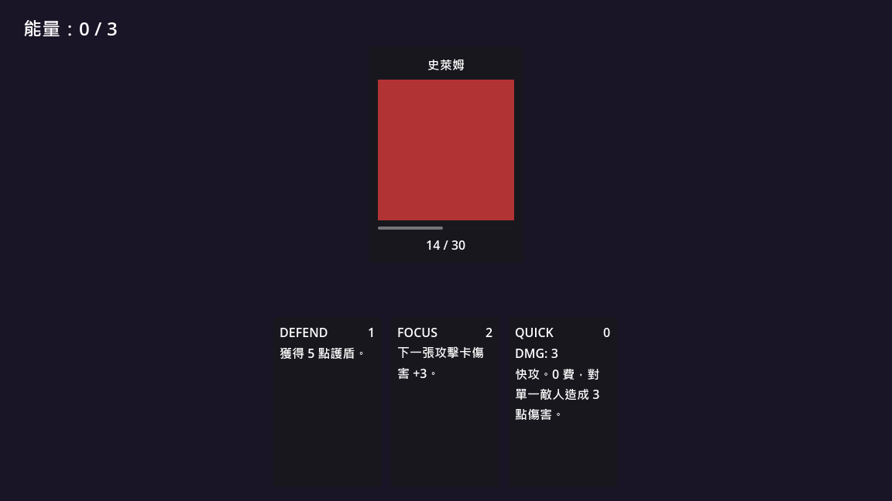

# Deckbuilder Prototype

Godot 4 卡牌戰鬥 prototype，作為 6 個月「前端轉 Godot」學習計畫 W4 練習。

**整合 W1-W3 全部觀念**：Custom Resource、Autoload、Signal、UI 容器、drag-and-drop。

> 學習路徑紀錄：[godot-learning-path](https://github.com/asd23353934/godot-learning-path)



## 玩法

- 畫面下方有 5 張手牌（STRIKE / DEFEND / FOCUS / HEAVY / QUICK），每張 cost / damage 各不同
- 中間是敵人（史萊姆 HP 30）
- **拖卡到敵人** → 扣能量 + 扣 HP + 卡牌消失
- 能量不足拖不起來（Output 印警告）
- 敵人 HP 歸零 → 顯示 **VICTORY!**

## Tech Stack

- **Engine**：Godot 4.6.3 (Standard)
- **語言**：GDScript
- **無 plugin 依賴**：純內建 API

## W1-W3 觀念整合

| 來自 | 用在 |
|---|---|
| W1 GDScript / signal | 全部 `.gd` 檔 |
| W2 場景組合 | Main 場景組 Hand + Enemy 兩個 .tscn |
| W2 Signal up + method down | Enemy emit `died` → Main 接 / Main `$Enemy.method()` 直 call |
| W3 Custom Resource | 5 張卡用 `.tres` 存資料 |
| W3 Autoload (GameState / EventBus) | 能量管理、卡牌 played 事件廣播 |

## W4 新概念

### Drag-and-drop（Godot 內建 3 個 method）

```
Card._get_drag_data(pos) → 開始拖時 call
  · 檢查能量
  · 設 drag preview（跟著滑鼠的卡視覺）
  · 回傳 self（讓 Enemy 拿得到原 Card）

Enemy._can_drop_data(pos, data) → 拖到上面時 call
  · 判斷 data 是不是 Card

Enemy._drop_data(pos, data) → 放開滑鼠時 call
  · GameState.spend_energy(cost)
  · take_damage(damage)
  · card.queue_free()
```

不靠任何 plugin，**30 行 code** 完成完整 drag-and-drop UX。

### UI 容器排版

- `PanelContainer`：卡片背景框
- `MarginContainer`：內邊距
- `VBoxContainer` / `HBoxContainer`：垂直 / 水平自動排
- `ProgressBar`：敵人 HP bar
- `unique_name_in_owner`：`%NodeName` 跨層 reference

## 專案結構

```
deckbuilder-prototype/
├── autoload/
│   ├── game_state.gd      # 玩家狀態 + 操作 API（W3 複用）
│   └── event_bus.gd       # 全域 signal hub（W3 複用）
├── cards/
│   ├── card_data.gd       # CardData class
│   ├── strike.tres        # STRIKE  cost 1 / dmg 6
│   ├── defend.tres        # DEFEND  cost 1 / dmg 0
│   ├── focus.tres         # FOCUS   cost 2 / dmg 0
│   ├── heavy.tres         # HEAVY   cost 2 / dmg 10
│   └── quick.tres         # QUICK   cost 0 / dmg 3
├── card.gd / card.tscn    # 一張卡的視覺 + drag 邏輯
├── hand.gd / hand.tscn    # 手牌容器（動態 instantiate cards）
├── enemy.gd / enemy.tscn  # 敵人 + HP bar + drop 接收
├── main.gd / main.tscn    # 主場景組合（背景 + UI + Enemy + Hand）
├── test/
│   ├── test_runner.gd     # 13 個單元測試
│   └── test_runner.tscn
└── project.godot
```

## Tests

13 個單元測試（沿用 W3.5 自寫 harness pattern，無 framework dependency）。

詳細解釋為何不用 GdUnit4 → 見 [card-resource-demo README 的 Tests 段](https://github.com/asd23353934/card-resource-demo#tests)。

### GameState autoload（9 個）

- `test_take_damage_normal`
- `test_take_damage_clamps_at_zero`
- `test_take_damage_emits_player_died_signal`
- `test_take_damage_emits_damage_dealt_signal`
- `test_heal_normal`
- `test_heal_clamps_at_max_hp`
- `test_spend_energy_sufficient`
- `test_spend_energy_insufficient`
- `test_reset_increments_run_count_once`

### Enemy scene（4 個）

- `test_enemy_take_damage_normal`
- `test_enemy_take_damage_clamps_at_zero`
- `test_enemy_take_damage_emits_died_signal`
- `test_enemy_dead_ignores_further_damage` ← regression test

### 跑測試

```
F6 → test/test_runner.tscn
```

預期：`Result: 13 passed, 0 failed`

## 執行方式

1. 安裝 [Godot 4.x Standard](https://godotengine.org/download)（驗證版本 4.6.3）
2. clone 此 repo
3. 開 Godot Project Manager → 匯入 → 選此資料夾的 `project.godot`
4. **F5** 跑 `main.tscn` 開始玩
5. **F6** 跑 `test/test_runner.tscn` 跑測試

## 限制 / 未來

這是 prototype，**不是完整遊戲**。已知缺：

- 只一隻敵人（無法選目標）
- 沒抽牌 / 棄牌 / 牌庫管理（手牌打完就沒了）
- 無敵人回合（敵人不會反擊）
- 無 status 系統（buff / debuff）
- 無視覺特效 / 音效

這些之後 M2-M3 在 [DiceFateSurvivor](https://github.com/asd23353934/dice-fate-survivor)（DFS 主產出）補完。

## License

MIT
